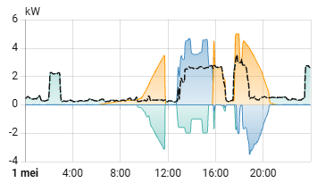

# Home Assistant – Dynamic Tariff Energy Control

Smart energy flow control for households with **solar panels, home batteries, EV charging, and heat pumps**, optimized for **dynamic electricity tariffs**.

This repository contains **three Home Assistant automations** that actively control:
- inverter power limits
- battery charge behavior
- grid injection and grid consumption

based on **real‑time dynamic import and export prices**.


---

## 🚀 Project Goals

- Avoid paying for grid injection during negative prices  
- Exploit negative consumption prices when available  
- Automatically manage inverter and battery behavior  
- Reduce manual intervention and tariff‑related mistakes  

---

## 🏠 System Overview

- ☀️ **Solar PV system**  
  - Peak production: **5 kW**
- 🔋 **2 plug‑in batteries**  
  - Charge / discharge power: **≈2.5 kW per battery**
- 🚗 **Electric Vehicle**
- 🌡 **Heat pump**  
  - Domestic hot water  
  - Floor heating
- ⚡ **Dynamic electricity contract**
  - Separate import & export prices
  - Prices can be positive or negative

---

## 🤖 Automations Overview

| Phase | File | Purpose |
|------|-----|---------|
| Phase 1 | `phase1.yaml` | Restore full inverter export when injection is profitable |
| Phase 2 | `phase2.yaml` | Limit solar production to avoid paid injection |
| Phase 3 | `phase3.yaml` | Force grid consumption when electricity prices are negative |

---

## 🧠 Energy Control Logic

### 🔹 Phase 1 – Pay to Consume, Get Paid to Inject
**File:** `phase1.yaml`

#### Trigger
- Injection price becomes **positive**

#### Actions
- Reset inverter export limit to **5000 W**
- Remove any previous solar production limitation

#### Purpose
Ensures the inverter returns to full operation once injection becomes profitable again.

---

### 🔹 Phase 2 – Pay to Consume and Pay to Inject
**File:** `phase2.yaml`

Injection prices are negative, so exporting power must be avoided.  
The inverter output is dynamically limited based on battery state of charge.

#### Phase 2.1 – Both batteries not full
- Both batteries < **98 %**
- Inverter limit set to **5000 W**
- Excess solar power is used to charge the batteries

#### Phase 2.2 – One battery full
- One battery > **99 %**
- One battery < **98 %**
- Inverter limit = `house power + 2400 W` (capped at 5000 W)
- Remaining battery continues charging without grid injection

#### Phase 2.3 – Both batteries full
- Both batteries > **99 %**
- Inverter limit follows household consumption
- Grid injection is minimized as much as possible

---

### 🔹 Phase 3 – Get Paid to Consume, Pay to Inject
**File:** `phase3.yaml`

#### Trigger
- Electricity price crosses **−0.05**
  - Below → get paid to consume
  - Above → pay to consume

#### When getting paid to consume
- Disable inverter throttling automations
- Set inverter output to **0**
- Disable inverter export
- Force both batteries into **charge mode**
- Enable RS485 battery control
- Actively charge batteries from the grid

#### When paying to consume again
- Re‑enable inverter control
- Disable forced battery charging
- Restore inverter anti‑feed configuration

---

## 📊 Energy Flow Example

The image below shows a real‑world energy flow day with operating phases annotated.


- Positive values → **grid injection**
- Negative values → **grid consumption**

---

## 🧩 Requirements

- Home Assistant
- Sensors for:
  - solar production
  - battery state of charge
  - grid import/export power
  - dynamic import & export prices
  - power of the house: 
```
{{states.sensor.inverter_active_power.state |float + states.sensor.marstek_ac_vermogen.state |float+ states.sensor.marstek_2_ac_vermogen.state |float+ states.sensor.p1_meter_vermogen.state |float}}
```
- Controllable entities for:
  - inverter power limit
  - battery charging mode
  - EV charger and/or heat pump (optional)

---

## 🔧 Customization

This setup is intentionally modular:

- Thresholds can be adjusted
- Power limits can be tuned
- Additional controllable loads can be integrated
- Logic can be extended with forecasts or day‑ahead prices

---

## ⚠️ Disclaimer

These automations directly influence **energy costs and grid behavior**.  
Always validate, monitor logs, and test carefully before unattended use.

---

## 🤝 Contributing

Improvements, alternative strategies, and adaptations for different markets or hardware are welcome.

Feel free to open an issue or pull request.